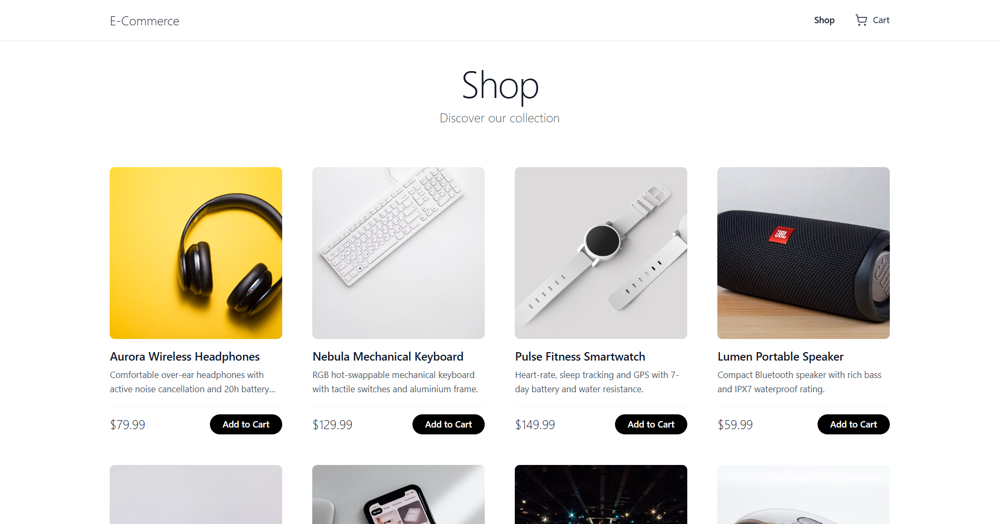
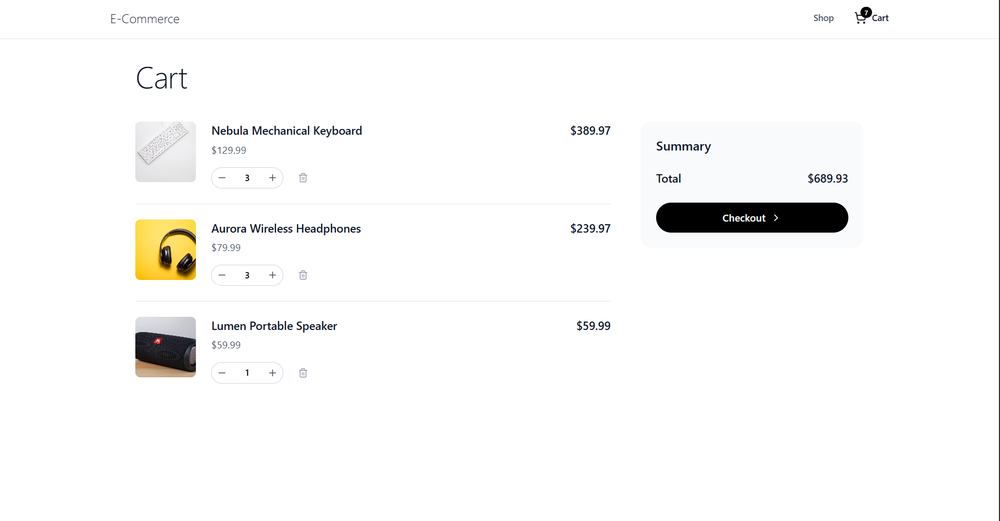
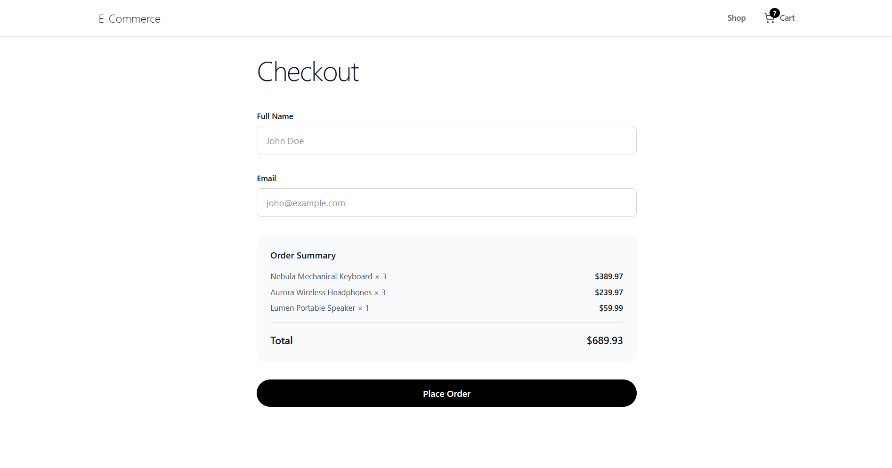
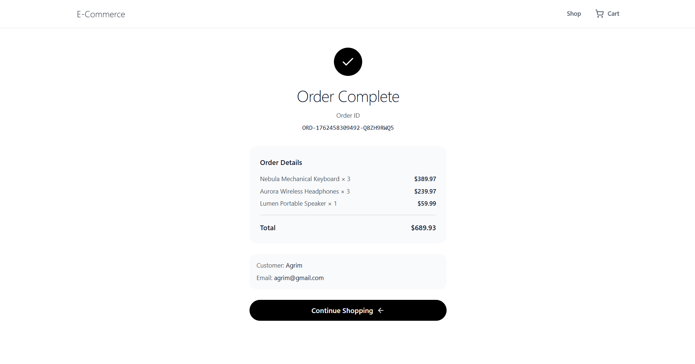

# Mock E-Commerce Shopping Cart

A full-stack shopping cart application built for Vibe Commerce screening. This project demonstrates a complete e-commerce flow with product listing, cart management, and checkout functionality.

## 🎥 Demo Video


[Watch Demo Video on Drive](https://drive.google.com/file/d/13Gy2CIAK3yOjjONfmuEGE6TMsXa-Aag9/view?usp=drivesdk)

>

## 📸 Screenshots

### Home Page

*Product grid with add to cart functionality*

### Cart Page

*Shopping cart with quantity controls and order summary*

### Checkout Page

*Checkout form with customer information*

### Receipt Modal

*Order confirmation receipt after successful checkout*


## 🚀 Features

- **Product Catalog**: Browse 8 mock products with images, descriptions, and prices
- **Shopping Cart**: Add, remove, and update item quantities
- **Real-time Cart Count**: Cart badge updates automatically in the navbar
- **Checkout Flow**: Complete checkout with customer information and order receipt
- **Database Persistence**: Cart items stored in MongoDB
- **Responsive Design**: Clean, minimal UI inspired by Apple's design language
- **Error Handling**: Comprehensive error handling throughout the application

## 🛠️ Tech Stack

### Backend
- **Node.js** with **Express.js**
- **MongoDB** with **Mongoose**
- **RESTful API** architecture

### Frontend
- **React 19** with **Vite**
- **React Router** for navigation
- **Tailwind CSS** for styling
- **Axios** for API calls
- **Lucide React** for icons

## 📁 Project Structure

```
nexora/
├── backend/
│   ├── controllers/
│   │   ├── cartController.js
│   │   └── productController.js
│   ├── models/
│   │   ├── cartSchema.js
│   │   └── productSchema.js
│   ├── routers/
│   │   ├── cartRouters.js
│   │   └── productRouters.js
│   ├── lib/
│   │   └── db.js
│   ├── seedProducts.js
│   ├── index.js
│   └── package.json
│
└── frontend/
    ├── src/
    │   ├── components/
    │   │   ├── Navbar.jsx
    │   │   └── ProductCard.jsx
    │   ├── pages/
    │   │   ├── HomePage.jsx
    │   │   ├── CartPage.jsx
    │   │   └── CheckoutPage.jsx
    │   ├── lib/
    │   │   └── axios.js
    │   ├── App.jsx
    │   └── main.jsx
    └── package.json
```

## 🔌 API Endpoints

### Products
- `GET /api/products` - Get all products (auto-seeds if empty)

### Cart
- `POST /api/cart` - Add item to cart
  ```json
  {
    "productId": "product_id_here",
    "qty": 1
  }
  ```
- `GET /api/cart` - Get cart items and total
- `DELETE /api/cart/:id` - Remove item from cart

### Checkout
- `POST /api/checkout` - Process checkout
  ```json
  {
    "name": "John Doe",
    "email": "john@example.com"
  }
  ```
  Returns: Order receipt with orderId, total, timestamp, and cart items

## 🚦 Getting Started

### Prerequisites
- Node.js (v16 or higher)
- MongoDB (local or MongoDB Atlas)
- npm or yarn

### Backend Setup

1. Navigate to backend directory:
```bash
cd backend
```

2. Install dependencies:
```bash
npm install
```

3. Create a `.env` file in the backend directory:
```env
MONGO_URI=your_mongodb_connection_string
```

4. Seed the database with products:
```bash
npm run seed
```

5. Start the server:
```bash
node index.js
```

The backend server will run on `http://localhost:5000`

### Frontend Setup

1. Navigate to frontend directory:
```bash
cd frontend
```

2. Install dependencies:
```bash
npm install
```

3. Start the development server:
```bash
npm run dev
```

The frontend will run on `http://localhost:5173`

